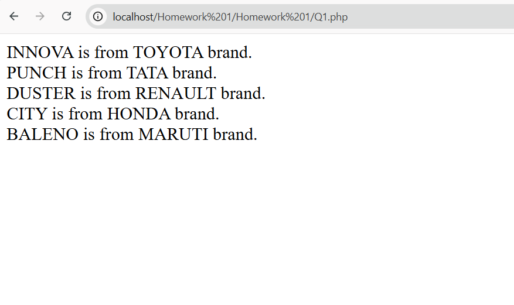
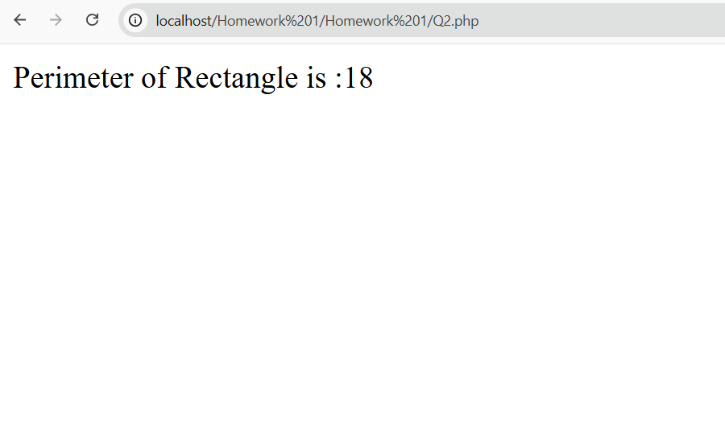
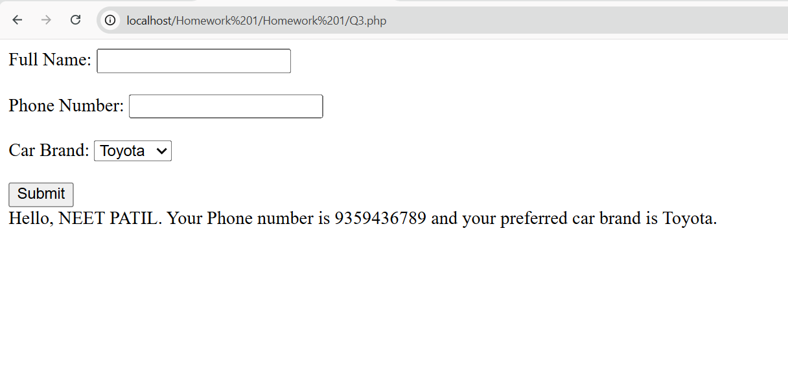
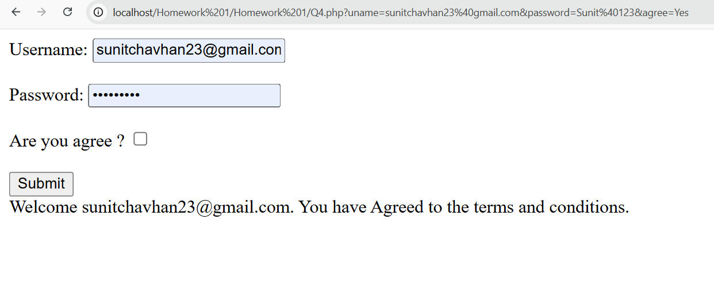
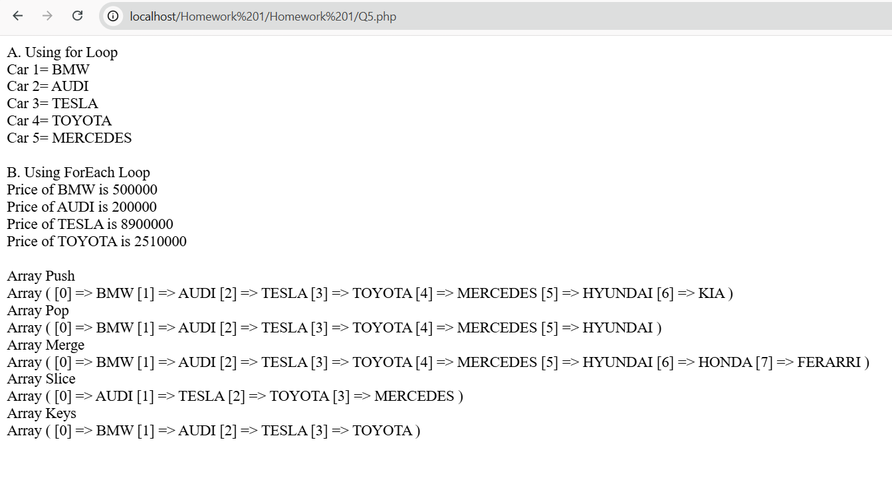
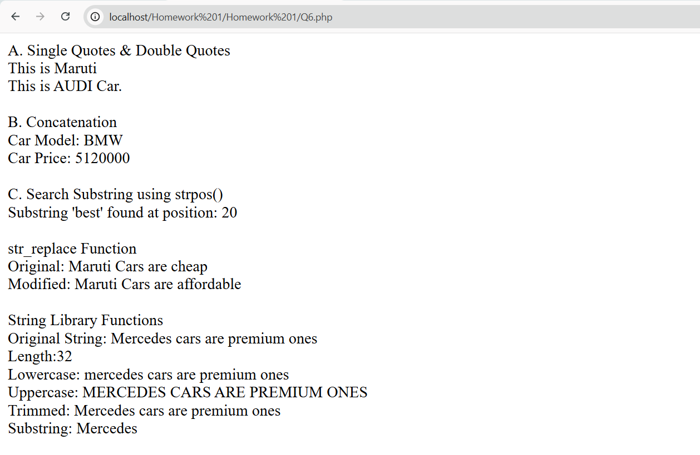

# PHP Homework 1

## 📌 Overview

This project contains basic PHP programs demonstrating core concepts like arrays, functions, form handling, and string operations. Each file (Q1–Q6) represents a separate task.

---

## 📂 Files Included
* **Q1.php** – Associative array with loop
* **Q2.php** – Function to calculate rectangle perimeter
* **Q3.php** – Form handling using POST
* **Q4.php** – Form handling using GET
* **Q5.php** – Array operations
* **Q6.php** – String functions

---

## ⚙️ Requirements
* PHP (7.x or higher)
* Local server (XAMPP / WAMP / MAMP)
* Web browser

---

## 🚀 How to Run
1. Place the folder inside `htdocs` (XAMPP).
2. Start Apache server.
3. Open in browser:
   http://localhost/Homework%201/Q1.php
4. Run other files (Q2–Q6) similarly.

---

## 📸 Screenshots
- Q1

- Q2

- Q3

- Q4

- Q5

- Q6

