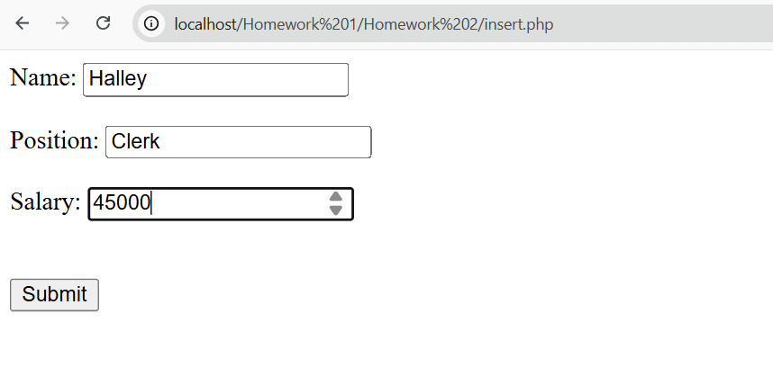
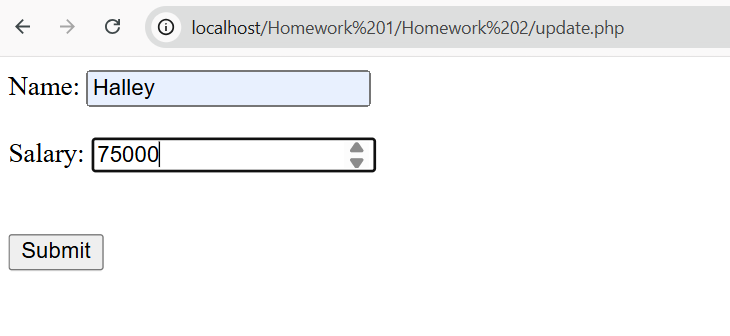
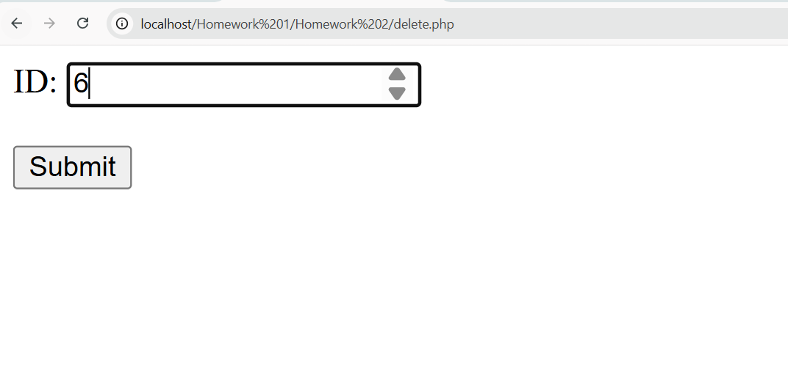
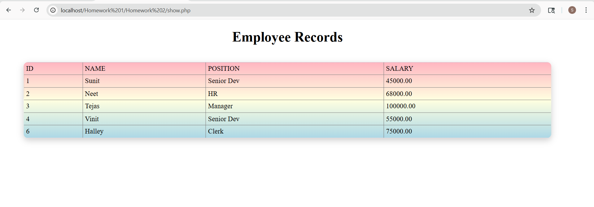
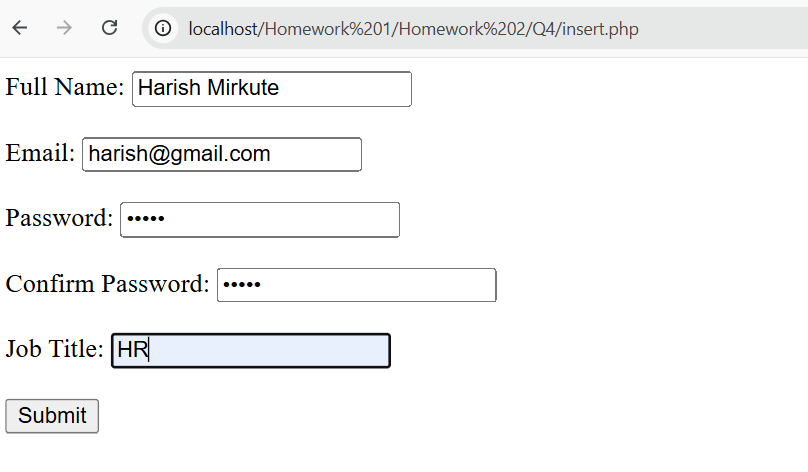
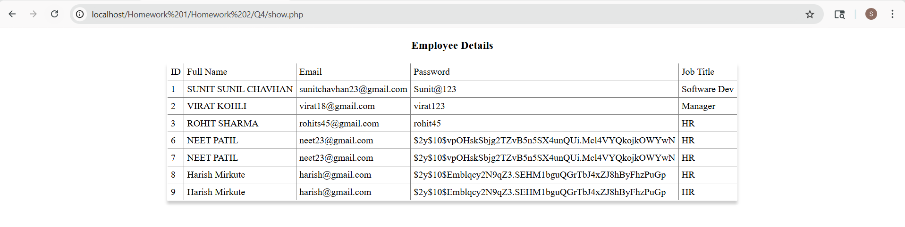

# Homework No. 02

## 📌 Overview

This project demonstrates connecting PHP with a MySQL database using **mysqli** and performing basic operations like creating tables, inserting data, updating, deleting, and displaying employee records. It also includes a registration form with validation.

---

## 📂 Folder Structure

```id="9k2lqp"
Q.4/
│── db1.php
│── insert.php
│── show.php

db.php
insert.php
update.php
delete.php
show.php
```

---

## ⚙️ Main Features

### 🔹 Database Connection
* Connects PHP to MySQL using **mysqli**
* Uses database: `employee_db`
---

### 🔹 CRUD Operations
* **Insert** – Add employee details (name, job title, salary)
* **Update** – Modify employee salary using ID
* **Delete** – Remove employee record by ID
* **Show** – Display all employee records

---

### 🔹 Table Creation & Display
* Creates `employees` table with:
  * `id` (Primary Key, Auto Increment)
  * `name`, `position`, `salary`
* Inserts sample records
* Displays data in an HTML table

---

### 🔹 Registration Form
* Fields: Name, Email, Password, Confirm Password, Job Title

#### Validation:
* All fields are required
* Passwords must match
* Email format must be valid
* Prevent duplicate email

#### Storage:
* Password is securely hashed
* Data stored in MySQL database

---

## 🚀 How to Run

1. Create database:
   CREATE DATABASE employee_db;

2. Place project in `htdocs` (XAMPP).
3. Start Apache & MySQL.
4. Open: 
   http://localhost/Q.4/show.php
   
---

## 📸 Screenshots
### Q1-Q3
* INSERT
- 

* UPDATE
- 

* DELETE
- 

* SHOW
- 


### Q4
* Insert
- 

* Show
- 
---
