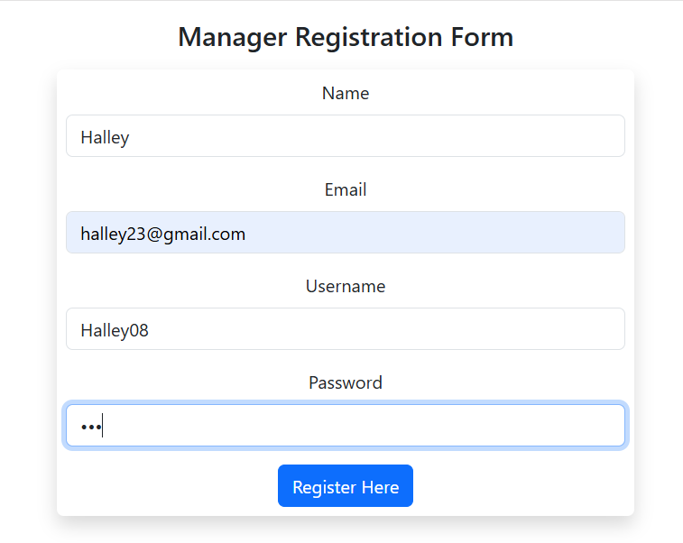
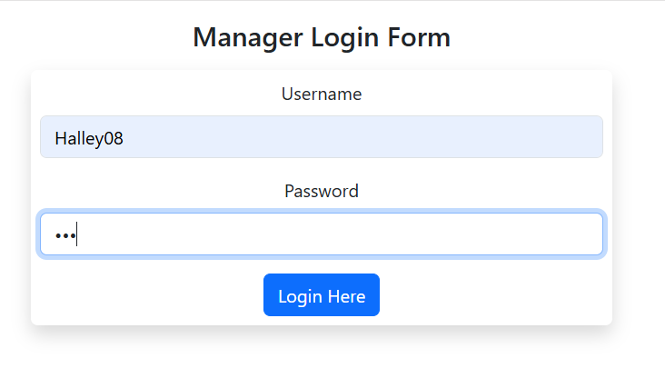
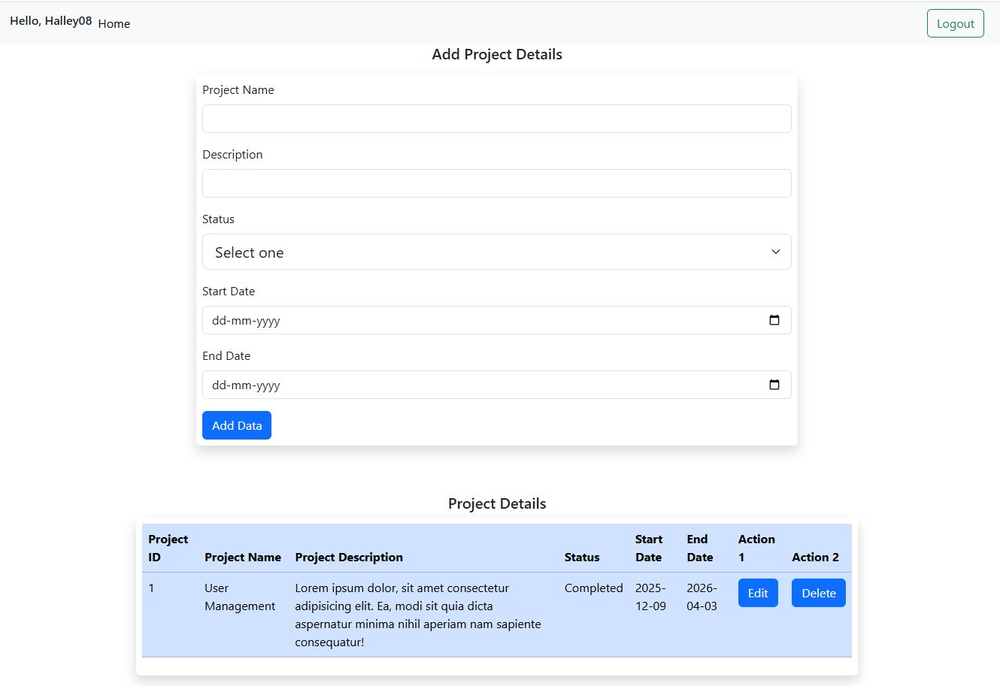
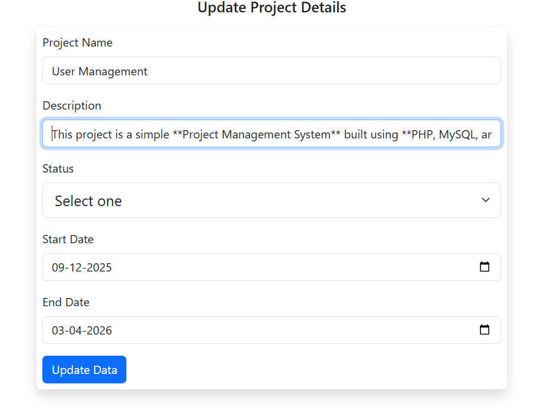

# 📌 Homework 3

## 📖 Overview

This project is a simple **Project Management System** built using **PHP, MySQL, and Bootstrap**. It allows managers to register, log in, and manage projects with basic CRUD operations.

---

## 🚀 Features

* Manager registration and login
* Secure password storage
* Add, edit, and delete projects
* View all project details
* Track project status (Pending / In Progress / Completed)
* Manage start and end dates

---

## 🗂️ Project Structure

```
Homework 3/
│── db.php
│── index.php
│── edit.php
│── delete.php
│── project_login.php
│── project_logout.php
│── project_registration.php
```

---

## 🛠️ Technologies Used

* Frontend: HTML, Bootstrap
* Backend: PHP
* Database: MySQL

---

## ⚙️ Setup Instructions

1. Move the project folder to:

   * `htdocs` (XAMPP) or `www` (WAMP)

2. Create a MySQL database and add tables:

```sql
CREATE TABLE manager (
    name VARCHAR(100),
    email VARCHAR(100),
    username VARCHAR(100) PRIMARY KEY,
    password VARCHAR(255)
);

CREATE TABLE project (
    id INT AUTO_INCREMENT PRIMARY KEY,
    project_name VARCHAR(255),
    project_description TEXT,
    status VARCHAR(50),
    start_date DATE,
    end_date DATE
);
```

3. Update database connection in `db.php`:

```php
$conn = new mysqli("localhost", "root", "", "your_database_name");
```

4. Run the project:

```
http://localhost/Homework%203/project_login.php
```

---

## 📌 Usage

Register → Login → Manage projects (Add / Edit / Delete)

---

## 📸 Screenshots
### Register


### Login


### Home Page


### Update Data
