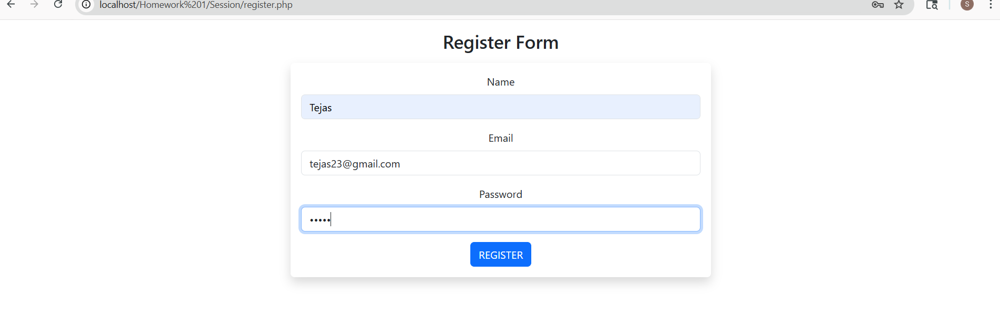
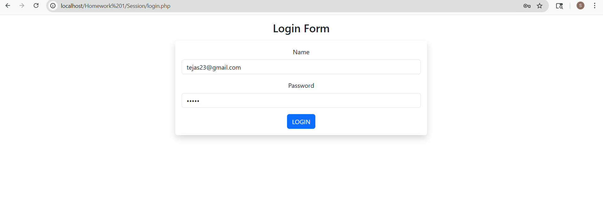
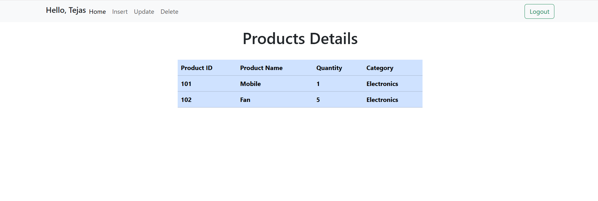
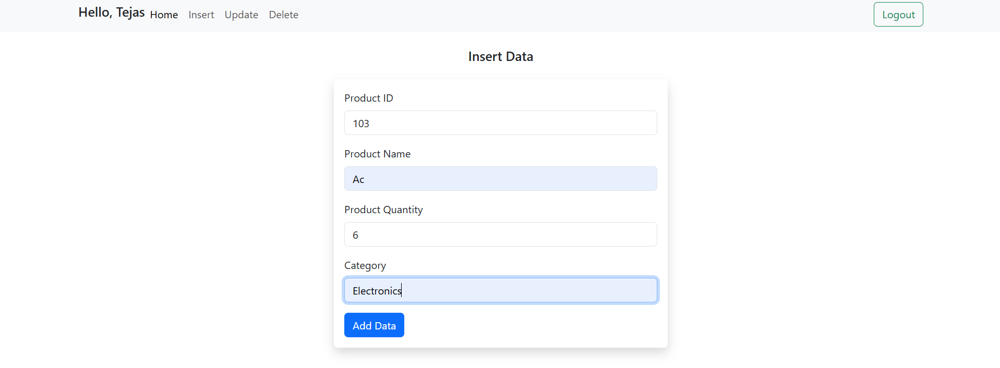
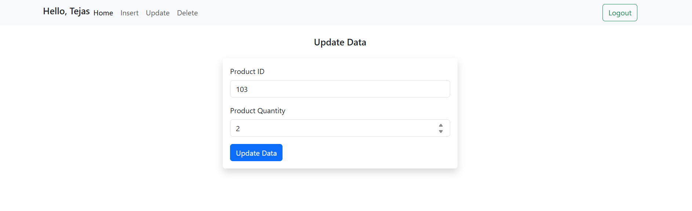
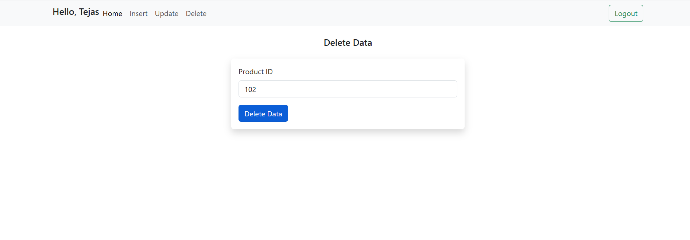

# Session

## 📌 Overview

This project is a simple **PHP-based web application** that demonstrates **user authentication and CRUD operations** using sessions. It is built to help understand how session management works in PHP along with basic database interaction.

---

## 📂 Folder Structure

Session/
│── db.php
│── insert.php
│── update.php
│── delete.php
│── home.php
│── login.php
│── logout.php
│── register.php
│── README.md

---

## ⚙️ Main Features

### 🔹 Database Connection
* Connects PHP to MySQL using **mysqli**
* Uses database: `sunit_php`
---

### 🔹 CRUD Operations
* **Insert** – Add employee details (product id, product name, product quantity,category)
* **Update** – Modify employee quantity using ID
* **Delete** – Remove product record by ID
* **Show** – Display all products records

-

---

### 🔹 Registration Form
* Fields: Name, Email, Password

#### Validation:
* All fields are required
* Passwords must match
* Email format must be valid
* Prevent duplicate email

#### Storage:
* Password is securely hashed
* Data stored in MySQL database

---

## 🚀 How to Run

1. Create database:
   CREATE DATABASE user;
   CREATE DATABASE products;

2. Place project in `htdocs` (XAMPP).
3. Start Apache & MySQL.
4. Open: 
   http://localhost/Q.4/show.php
   
---
## 📸 Screenshots
### Register

### Login

### Home Page

### Insert

### Update

### Delete
